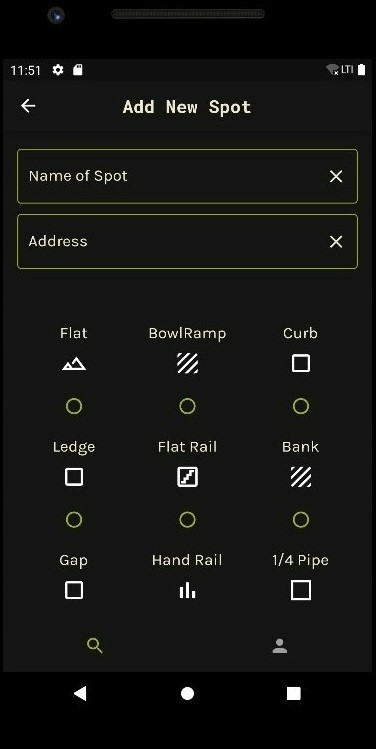
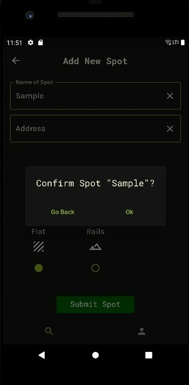

API key stored in ./skateright_flutter/android/app/src/main/AndroidManifest.xml
under android:value=...
copy + paste into there

# Photos

## Sprint 6
#### Goal: Allow users to add custom skate spots

## Sprint 5
#### Goal: Add Search Functionality

## Sprint 4
#### Goal: Create profile section and enhance app style

## Sprint 1-3
#### Goal: Display a map containing skate spots and show information about each spot

